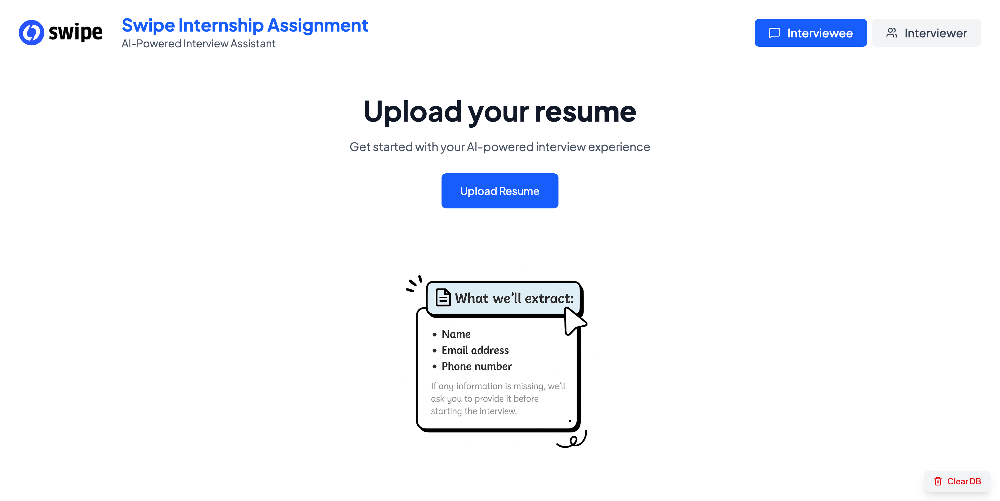
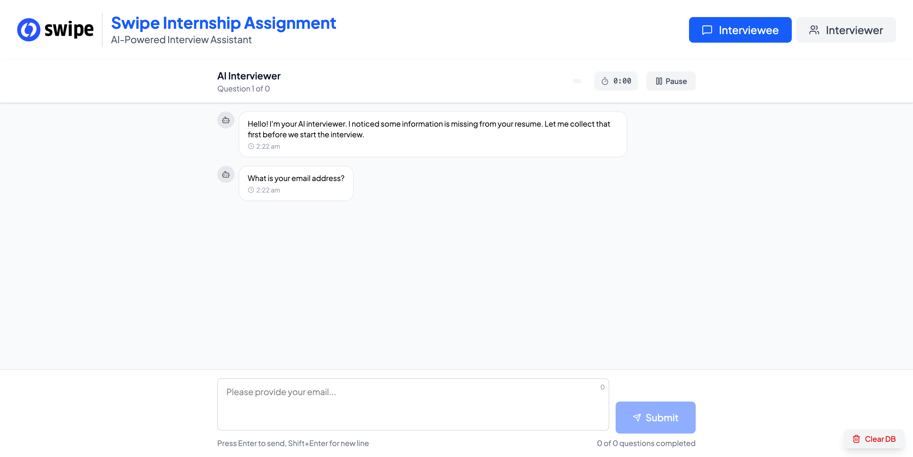
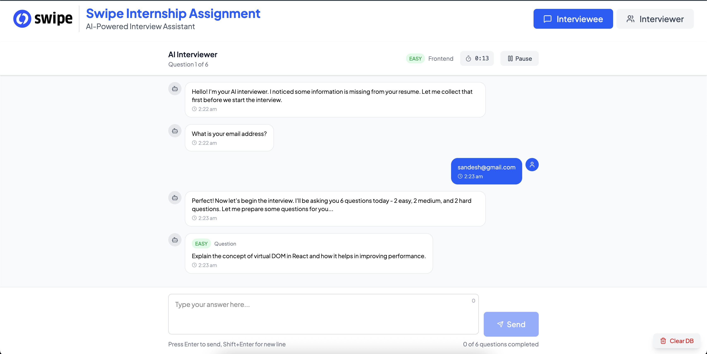
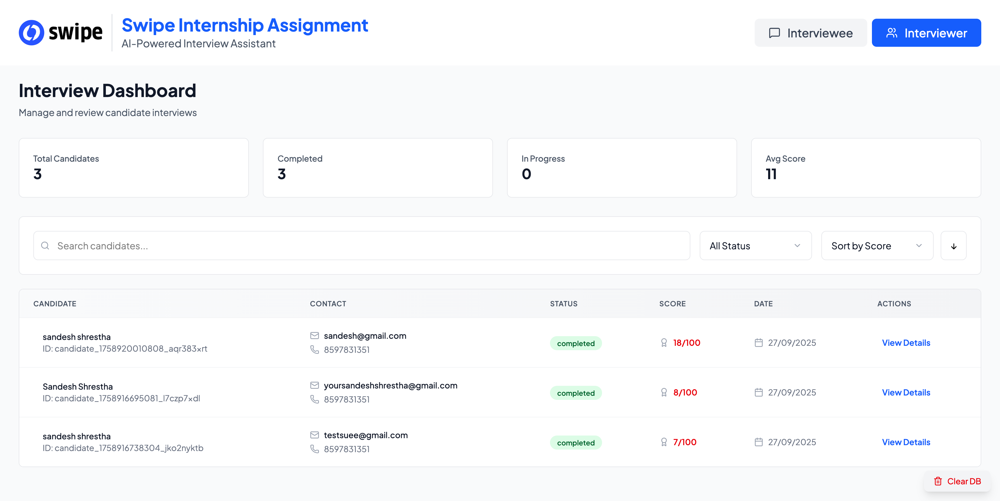
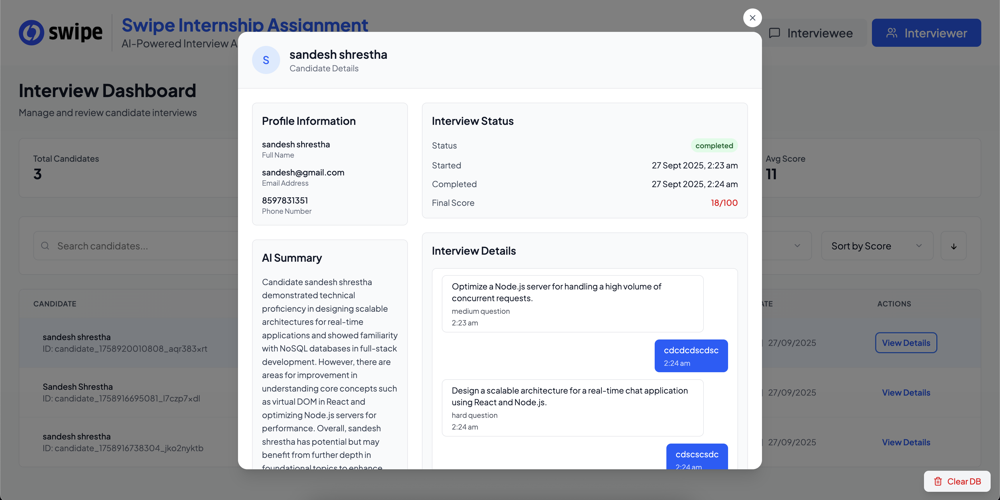
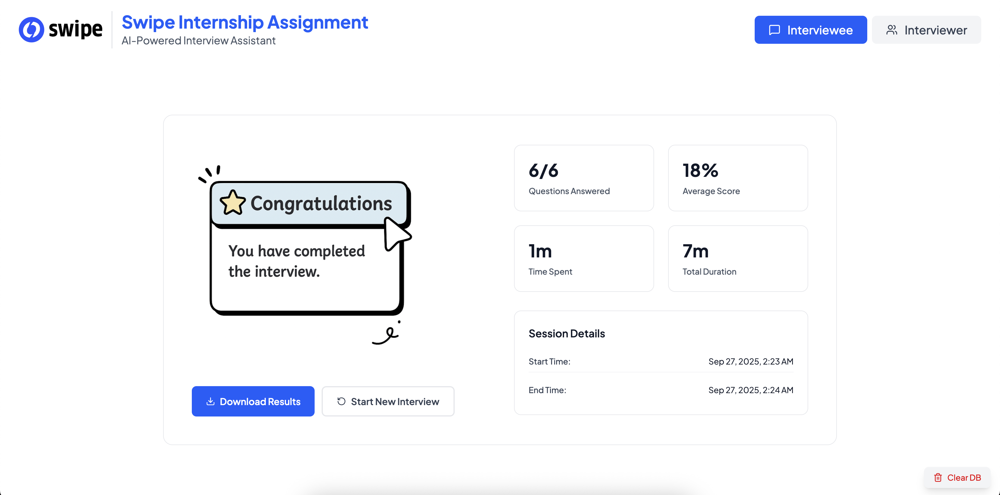
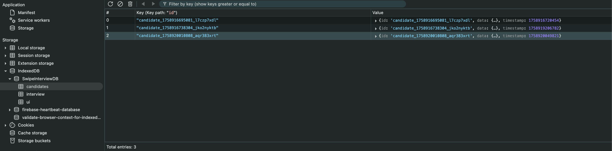
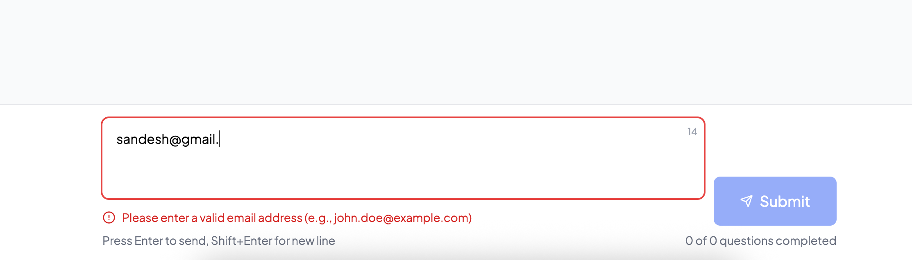
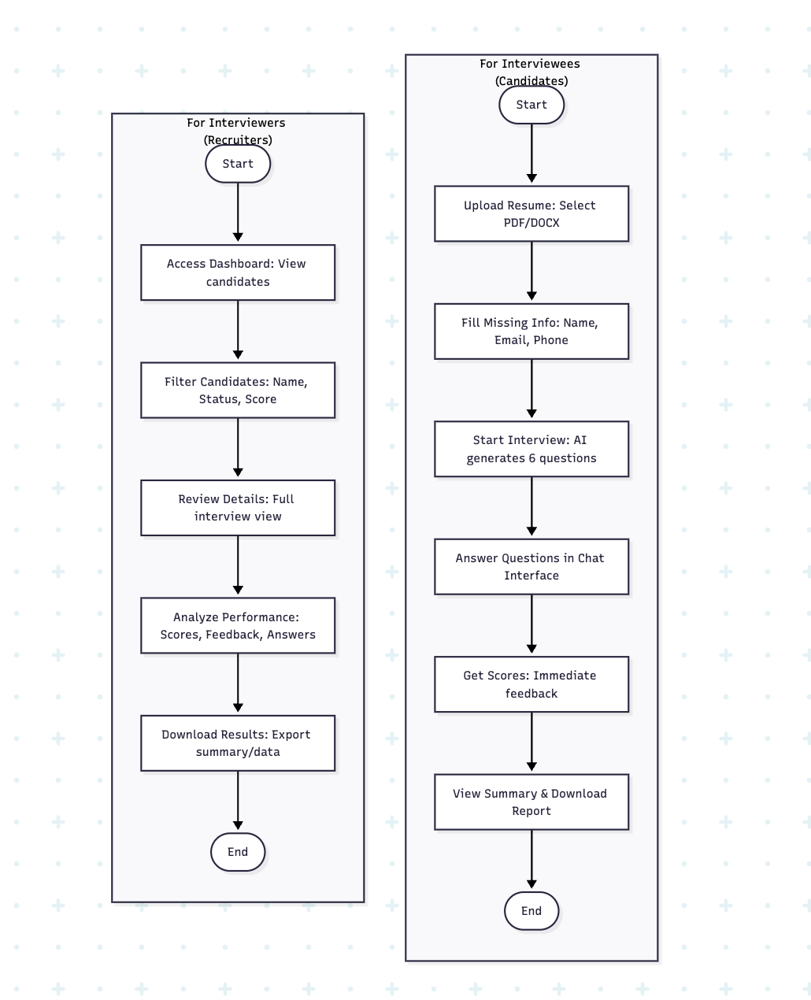
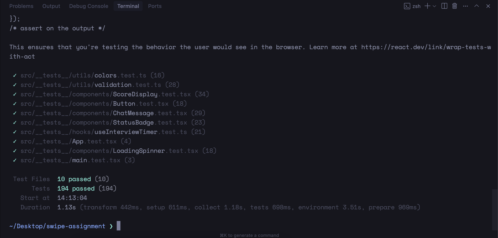

# Assignment 101

A React-based interview application that allows users to upload resumes and conduct AI-powered interviews.

## Features

- Resume Upload: Accept PDF/DOCX files and extract Name, Email, Phone
- AI Interview: Generate and conduct technical interview questions
- Answer Scoring: AI evaluates answers and provides feedback
- Candidate Management: View and manage interview candidates
- Real-time Chat: Interactive interview experience

## How it Works

1. **Upload Resume**: User uploads a PDF or DOCX resume
2. **Extract Information**: System extracts name, email, and phone number
3. **Start Interview**: AI generates 6 technical questions (2 easy, 2 medium, 2 hard)
4. **Answer Questions**: User answers questions through chat interface
5. **Get Feedback**: AI scores answers and provides detailed feedback
6. **View Results**: Interviewer can view candidate performance and download results

## User Flow

### For Interviewees (Candidates)

1. **Upload Resume** → Select PDF/DOCX file
2. **Fill Missing Info** → Complete name, email, phone if not extracted
3. **Start Interview** → AI generates 6 technical questions
4. **Answer Questions** → Type responses in chat interface
5. **Get Scores** → Receive immediate feedback on each answer
6. **View Summary** → See final results and download report

### For Interviewers (Recruiters)

1. **Access Dashboard** → View all candidates
2. **Filter Candidates** → Search by name, status, or score
3. **Review Details** → Click on candidate to see full interview
4. **Analyze Performance** → Check scores, feedback, and answers
5. **Download Results** → Export candidate summary and data

## Tech Stack

### Frontend

- **React 19** - UI framework
- **TypeScript** - Type safety
- **Redux Toolkit** - State management
- **Tailwind CSS** - Styling
- **Lucide React** - Icons
- **Vite** - Build tool

### Backend

- **Python Flask** - Web framework
- **OpenAI API** - AI integration
- **pdfplumber** - PDF parsing
- **python-docx** - DOCX parsing
- **email-validator** - Email validation

### Storage & Data

- **IndexedDB** - Client-side storage
- **Redux Persist** - State persistence
- **JSON** - Data format

## UI Showcase

### Resume Upload Screen



### Filling Missing Details



### Question Generation



### Interviewer Dashboard



### Student Detail Modal



### Summary Screen



### Database Indexed



### Error Message



### Flowchart



### Test Screen



## How to Run Locally

### Prerequisites

- **Node.js** (v18 or higher)
- **Python** (3.8 or higher)
- **npm** or **yarn** package manager

### Setup Instructions

#### 1. Clone the Repository

```bash
git clone <repository-url>
cd swipe-assignment
```

#### 2. Backend Setup

1. **Navigate to the backend directory:**

   ```bash
   cd backend
   ```

2. **Install Python dependencies:**

   ```bash
   python3 setup.py
   ```

   Or manually install:

   ```bash
   pip install -r requirements.txt
   ```

3. **Start the backend server:**
   ```bash
   python3 app.py
   ```
   The backend will be available at port you set in .env (for example) `http://localhost:5000`

#### 3. Frontend Setup

1. **Navigate back to the root directory:**

   ```bash
   cd ..
   ```

2. **Install Node.js dependencies:**

   ```bash
   npm install
   ```

3. **Start the development server:**
   ```bash
   npm run dev
   ```
   The frontend will be available at `http://localhost:5173`

#### 4. Access the Application

- **Frontend**: Open `http://localhost:5173` in your browser
- **Backend API**: Available at `http://localhost:5000`
- **API Documentation**: Visit `http://localhost:5000/docs` for Swagger documentation

#### Frontend Commands

````bash
# Start development server
npm run dev

# Build for production
npm run build

# Preview production build
npm run preview

# Run tests
npm run test

# Run tests with coverage
npm run test:coverage

#### Backend Commands

```bash
# Start the Flask server
python3 app.py

# Install dependencies
python3 setup.py
````

### Environment Variables

The application uses environment variables for configuration. Create a `.env` file in the root directory if needed:

```env
# OpenAI API Key (for AI features)
OPENAI_API_KEY=your_openai_api_key_here

# Backend URL (default: http://localhost:5000)
VITE_API_BASE_URL=http://localhost:5000
```

### Troubleshooting

#### Common Issues

1. **Port already in use**: If port 5000 or 5173 is already in use, you can:

   - Kill the process using the port: `lsof -ti:5000 | xargs kill -9`
   - Or change the port in the respective configuration files

2. **Python dependencies issues**: Make sure you're using Python 3.8+ and pip is up to date:

   ```bash
   python3 --version
   pip3 --version
   ```

3. **Node.js version issues**: Ensure you're using Node.js v18 or higher:

   ```bash
   node --version
   ```

4. **CORS issues**: The backend includes CORS support, but if you encounter issues, make sure the backend is running on the correct port.

### Production Build

To create a production build:

1. **Build the frontend:**

   ```bash
   npm run build
   ```

2. **The built files will be in the `dist/` directory**

3. **Serve the built files using a static file server or deploy to your hosting platform**
